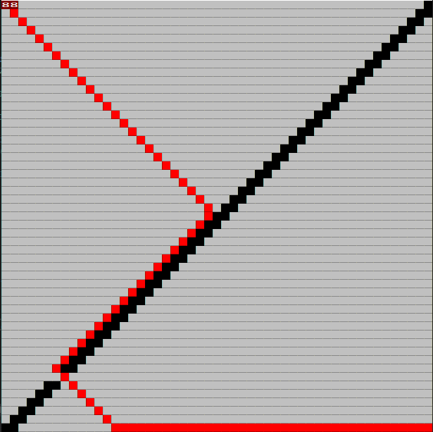

# Dijkstra and A\* Visualisation  
This project only works on Windows.  
Made with javidx9's olcConsoleGameEngine : 
https://github.com/OneLoneCoder/videos/blob/master/olcConsoleGameEngine.h

# Astar Vs Dijkstra

  

  
After this test I thought one of my algorithm had a problem because they didn't find the same solution. So I displayed the score and it showed that they just foound different path with the same score.

# Astar Vs Dijkstra on maze

  

